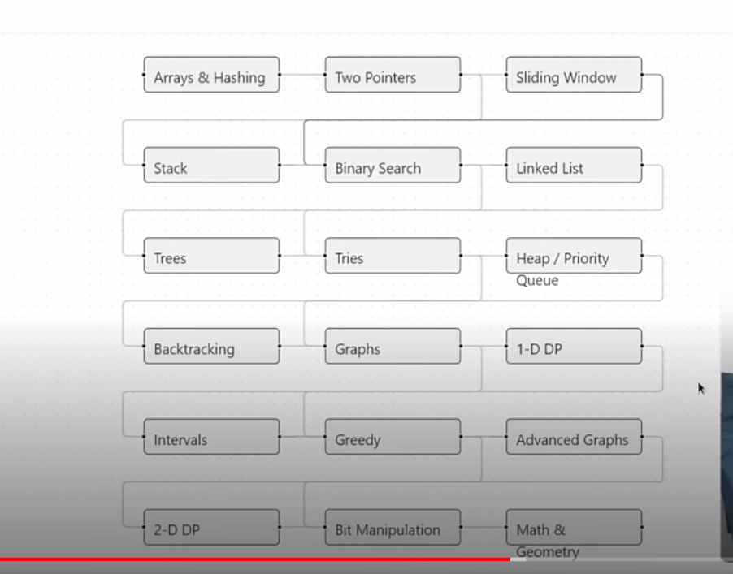
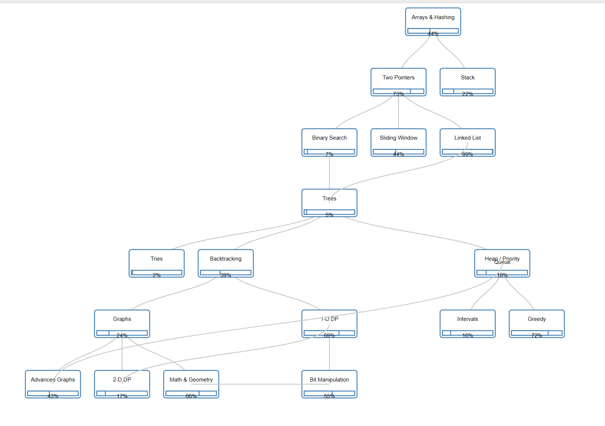
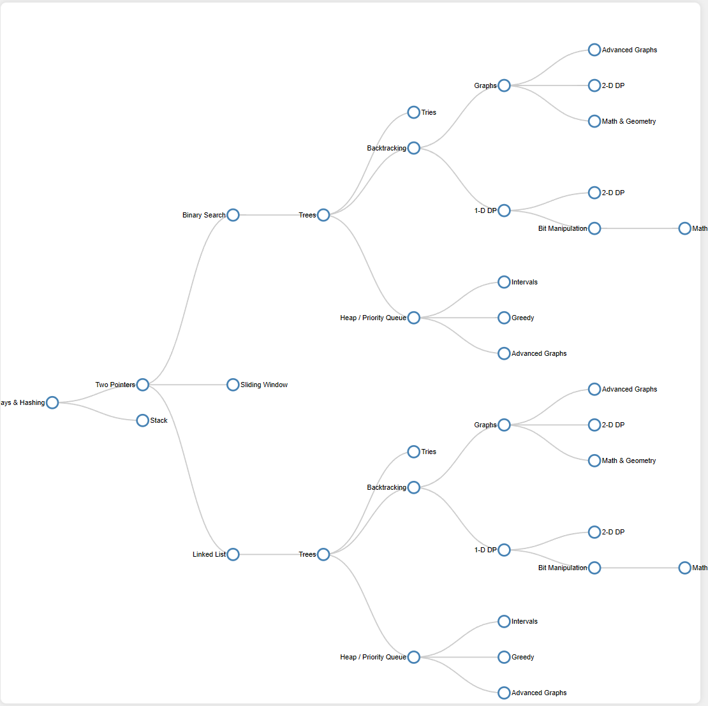
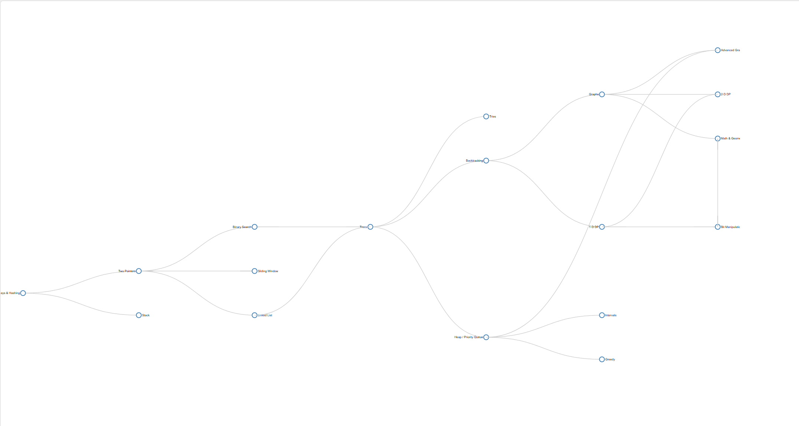
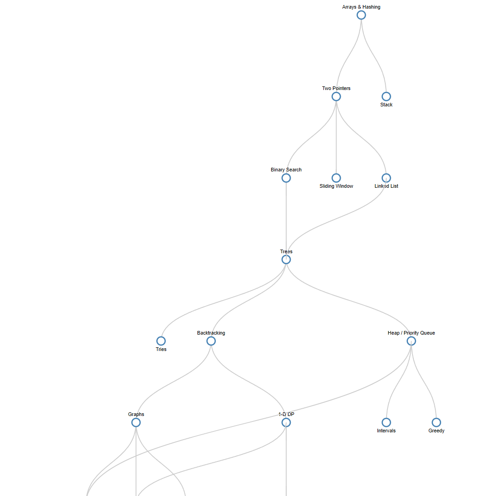
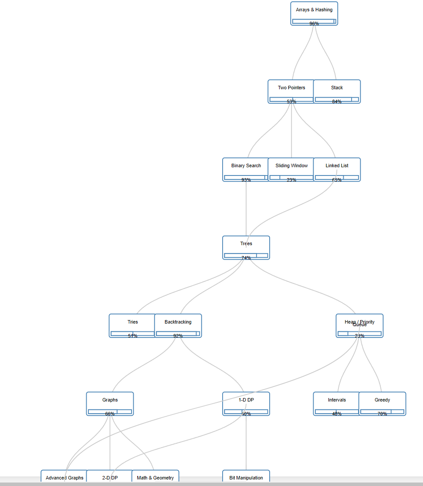

# Claude Example

Watching Prime's video reacting to Neetcode's reaction to a post about
Claude enabling 10x speed.  At 24:30 they are showing an example of someone
that tried to recreate part of NeetCode's site that shows a graph in what looks
like SVG of what I assume are practice areas:


This is what the attempt was shown as:



That does look a lot different and not as good.  Things aren't linked the
same for one thing.   This is my attempt using Claude in 10 minutes:



This isn't perfect by any means, but it was fast.  I spent 5 minutes
markdown to represent the tree and 5 minutes giving Claude about 4 prompts.

The resulting code has the tree structure in JSON as input.  It wouldn't take
much time to change this to use results from a database call. There are
some fixes that need to be made.  

I'm no D3.js expert although I've used it a couple of times, mostly copying from
examples and making it work with my data.  It would probably take me a couple
of hours to write this, relying on google searches to find how to use D3.js.

## Prompts

### First Prompt

This is after 5 minutes of creating the markdown representation fo the graph
shown in the video and ask Claude to convert it to JSON:

> Create a representation of a tree in JSON given this markdown:

```
## Arrays & Hashing

* Two Pointers
* Stack
...
```

<details>
    <summary>Full Markdown</summary>

```
## Arrays & Hashing

* Two Pointers
* Stack

## Two Pointers

* Binary Search
* Sliding Window
* Linked List

## Stack

## Binary Search

* Trees

## Linked List

* Trees

## Trees

* Tries
* Backtracking
* Heap / Priority Queue

## Tries

## Backtracking

* Graphs
* 1-D DP

## Heap/Priority Queue

* Intervals
* Greedy
* Advanced Graphs

## Graphs

* Advanced Graphs
* 2-D DP
* Math & Geometry

## 1-D DP

* 2-D DP
* Bit Manipulation

## Bit Manipulation

* Math & Geometry

```

</details>

## Prompt 2

Now I have a JSON representation and I've checked that it makes sense.  It
simply lists nodes, and nodes have a 'children' element with the names
of the child nodes.  Next I entered this prompt:

> Given that JSON, create a web page showing the nodes and links

This is what the preview looks like:



It explains what it did, I notice it uses D3.js from a cdn.


### Prompt 3

I noticed that some nodes were duplicated, so I gave it this prompt:

> Combine nodes with the same names into a single node

This is what the preview looks like:



### Prompt 4

Ok, lookin like the data is represented how I want, now to make it vertical:

> make the graph vertical instead of horizontal

This is what the preview looks like:



### Prompt 5

Now to style it better...

> Change the nodes to boxes that also contain progress bars

This is what the preview looks like:



This is what I had after 10 minutes.  1/2 the time was creating markdown with
the data I wanted to use.  There may be a d3 expert out there that could
write exactly the code to create this graph in 5 minutes, but I doubt it.
The whole time would be typing as fast as I've ever typed before and knowing
exactly what you want to type ahead of time.
